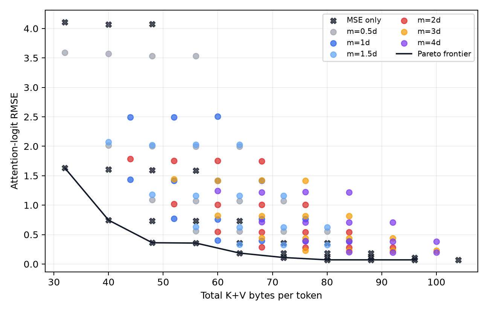
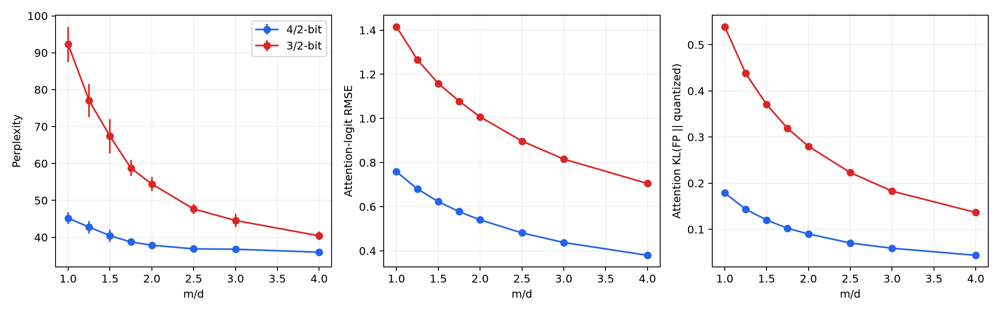
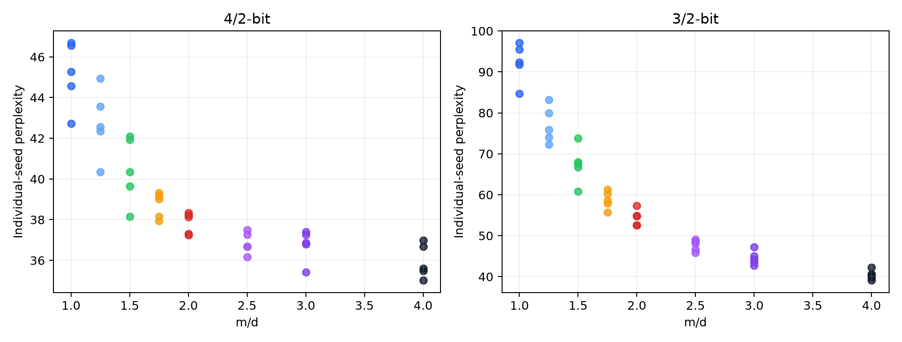
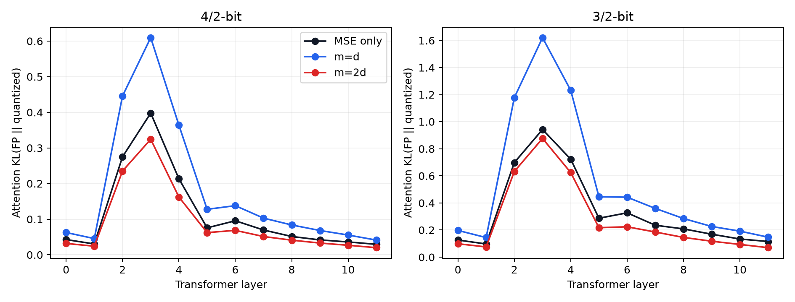

# Phase 2 validation: QJL measurement-budget allocation

This decision document is generated by `scripts/render_phase2_validation.py`
from immutable JSONL runs and programmatically generated summaries. The final
classification is **Verdict A — Stop**: larger QJL sketches improve a QJL-based
estimator, but oversized QJL is consistently dominated by scalar-only
allocations at equal or lower measured storage, and the basic `m>d` idea is
already present in the original QJL implementation. The evidence does not
justify larger-model spending on the proposed positive hypothesis.

## 1. Current hypothesis

The candidate hypothesis was that the useful QJL measurement budget is not
universally `m=d`, that it changes with quantization severity, and that spending
extra fixed-cache budget on QJL measurements can sometimes beat spending those
bytes on scalar key/value precision.

Phase 2 separates two claims:

1. **Conditional claim:** given a scalar K/V configuration that already uses
   residual QJL, increasing `m` improves attention and downstream PPL.
2. **Allocation claim:** given a fixed total KV-cache byte budget, extra QJL
   measurements are a competitive use of those bytes.

The first survives. The second—the paper-critical claim—does not.

## 2. Experimental controls

- Model: GPT-2 (`gpt2`, approximately 124M parameters), 12 layers, 12 heads,
  head dimension `d=64`; model revision `607a30d783dfa663caf39e06633721c8d4cfcd7e` and
  weight SHA-256 `248dfc3911869ec493c76e65bf2fcf7f615828b0254c12b473182f0f81d3a707`.
- Data: `Salesforce/wikitext:wikitext-2-raw-v1:test`, first 512 tokens,
  context limit 1024; shard SHA-256 `5f1bea067869d04849c0f975a2b29c4ff47d867f484f5010ea5e861eab246d91`.
- Device/software: FP16 on Apple MPS; PyTorch
  `2.15.0.dev20260831`, Transformers
  `5.16.1`.
- Randomness: QJL projection seeds `11, 23, 37, 53, 71`; model, tokens,
  rotations, scalar codebooks, quantization settings, and evaluation path are
  fixed. Seeds are paired for central QJL comparisons. MSE-only has no QJL
  randomness; duplicated seed-labelled runs are deterministic controls, not
  five independent estimates.
- Measurement normalization: `sqrt(pi/2)/m`; the independent sanity study fit
  QJL MSE slope `-0.999` versus `m`, rejecting accidental fixed-`d`
  normalization.
- Storage: packed scalar indices, packed QJL signs, one FP32 vector norm, an
  additional FP32 residual norm when QJL is active, and value metadata are
  included per token. Shared projections are reported separately. For example,
  4/2-bit Gaussian QJL uses 60 bytes/token at `m=d` and
  68 at `m=2d`; its shared projections use
  2.25 and
  4.50 MiB total, respectively.
- Scope: 553 allocation runs covering 121 summarized configurations, 80
  fine-sweep runs covering 16 configurations, and 20 post-gate
  block-orthogonal runs covering four configurations.
- Analysis unit: the projection seed, never individual tokens. Central paired
  intervals are two-sided 95% t intervals over five seed-level differences.

The primary allocation and fine sweeps use independent Gaussian projection
rows, matching the local TurboQuant reference's residual QJL. Because the
original QJL paper orthogonalizes projection rows, a separately labelled
block-orthogonal sensitivity control was added after the stop gate.

## 3. Equal-budget results

At the two preregistered exact-byte comparisons, allocating the bytes to scalar
precision won:

- At 60 bytes/token, 4/2-bit `m=d` scored 45.16 +/-
  1.63 PPL, while 3/2-bit `m=2d` scored
  54.43 +/- 1.94. The oversized
  allocation was worse by 9.27 PPL, with 95%
  paired CI [5.11,
  13.43].
- At 68 bytes/token, 5/2-bit `m=d` scored 35.43 +/- 0.79, while 4/2-bit
  `m=2d` scored 37.84 +/- 0.53.
  The oversized allocation was worse by 2.41
  PPL, 95% paired CI [0.93,
  3.90].

The stronger control removed residual QJL entirely (`m=0`) and used its bytes
for scalar precision. At 4/2 bits, MSE-only scored 39.91 PPL at 48 bytes versus
45.16 for `m=d` at 60 bytes. At 3/2 bits, it scored 57.00 at 40 bytes versus
92.29 for `m=d` at 52 bytes. A high-precision scalar extension closed an
initially truncated frontier: every measured PPL Pareto point through 88 bytes
is MSE-only.

| KV bytes/token | Allocation (K/V, m/d) | PPL | Logit RMSE | Attention KL |
|---:|---:|---:|---:|---:|
| 32 | 3/1, MSE-only | 96.76 | 1.631 | 0.369 |
| 40 | 3/2, MSE-only | 57.00 | 1.604 | 0.339 |
| 48 | 4/2, MSE-only | 39.91 | 0.733 | 0.113 |
| 56 | 5/2, MSE-only | 35.01 | 0.356 | 0.033 |
| 64 | 5/3, MSE-only | 32.83 | 0.355 | 0.031 |
| 72 | 5/4, MSE-only | 32.16 | 0.355 | 0.031 |
| 80 | 6/4, MSE-only | 31.29 | 0.185 | 0.009 |
| 88 | 6/5, MSE-only | 30.90 | 0.186 | 0.008 |

The 6/5-bit MSE-only point at 88 bytes is 0.03 PPL below this short slice's FP16
value (30.93). That tiny reversal is treated as numerical/slice-level variation,
not evidence that quantization improves the model.

### Projection-construction sensitivity

Block orthogonalization substantially improves QJL and was therefore a real
implementation confounder. It does not change the allocation verdict: all four
tested block-orthogonal QJL points remain worse than an MSE-only allocation
using four fewer bytes/token.

| Projection | K/V | m/d | Bytes | PPL mean +/- SD | Logit RMSE | Best MSE-only at <= bytes | PPL penalty |
|---|---:|---:|---:|---:|---:|---:|---:|
| block-orthogonal | 3/2 | 1 | 52 | 49.16 +/- 2.28 | 0.840 | 4/2 at 48 B (39.91) | +9.26 |
| Gaussian | 3/2 | 1 | 52 | 92.29 +/- 4.77 | 1.416 | 4/2 at 48 B (39.91) | +52.38 |
| block-orthogonal | 3/2 | 2 | 60 | 39.84 +/- 0.72 | 0.597 | 5/2 at 56 B (35.01) | +4.83 |
| Gaussian | 3/2 | 2 | 60 | 54.43 +/- 1.94 | 1.007 | 5/2 at 56 B (35.01) | +19.42 |
| block-orthogonal | 4/2 | 1 | 60 | 36.95 +/- 0.59 | 0.456 | 5/2 at 56 B (35.01) | +1.94 |
| Gaussian | 4/2 | 1 | 60 | 45.16 +/- 1.63 | 0.758 | 5/2 at 56 B (35.01) | +10.15 |
| block-orthogonal | 4/2 | 2 | 68 | 34.87 +/- 0.62 | 0.323 | 5/3 at 64 B (32.83) | +2.04 |
| Gaussian | 4/2 | 2 | 68 | 37.84 +/- 0.53 | 0.540 | 5/3 at 64 B (32.83) | +5.02 |

## 4. Fine-grained `m` results

### 4/2-bit Gaussian residual QJL

| m/d | KV bytes/token | PPL mean +/- SD | 95% CI | Logit RMSE | Attention KL | PPL gain / added byte | Gain closed |
|---:|---:|---:|---:|---:|---:|---:|---:|
| 1 | 60 | 45.16 +/- 1.63 | [43.14, 47.19] | 0.758 | 0.179 | -- | 0.0% |
| 1.25 | 62 | 42.76 +/- 1.70 | [40.65, 44.87] | 0.680 | 0.144 | 1.204 | 26.1% |
| 1.5 | 64 | 40.44 +/- 1.65 | [38.38, 42.49] | 0.623 | 0.120 | 1.161 | 51.3% |
| 1.75 | 66 | 38.72 +/- 0.63 | [37.93, 39.51] | 0.577 | 0.102 | 0.858 | 70.0% |
| 2 | 68 | 37.84 +/- 0.53 | [37.18, 38.50] | 0.540 | 0.090 | 0.438 | 79.5% |
| 2.5 | 72 | 36.86 +/- 0.53 | [36.20, 37.51] | 0.481 | 0.070 | 0.246 | 90.2% |
| 3 | 76 | 36.76 +/- 0.79 | [35.78, 37.73] | 0.438 | 0.059 | 0.026 | 91.3% |
| 4 | 84 | 35.95 +/- 0.84 | [34.91, 37.00] | 0.380 | 0.044 | 0.100 | 100.0% |

The marginal gain falls from 1.204 PPL per added byte over `1d -> 1.25d` to
0.026 over `2.5d -> 3d`, before a small 0.100 rebound over the wider
`3d -> 4d` interval. The smallest tested point achieving 90% of the observed
`m=d -> 4d` gain is `2.5d`.
There is curvature, but no finite unconstrained optimum was located because PPL
still declines slightly through `4d`.

### 3/2-bit Gaussian residual QJL

| m/d | KV bytes/token | PPL mean +/- SD | 95% CI | Logit RMSE | Attention KL | PPL gain / added byte | Gain closed |
|---:|---:|---:|---:|---:|---:|---:|---:|
| 1 | 52 | 92.29 +/- 4.77 | [86.37, 98.21] | 1.416 | 0.539 | -- | 0.0% |
| 1.25 | 54 | 77.08 +/- 4.45 | [71.55, 82.61] | 1.266 | 0.438 | 7.603 | 29.3% |
| 1.5 | 56 | 67.39 +/- 4.61 | [61.66, 73.11] | 1.159 | 0.371 | 4.847 | 48.0% |
| 1.75 | 58 | 58.74 +/- 2.16 | [56.06, 61.43] | 1.078 | 0.319 | 4.322 | 64.6% |
| 2 | 60 | 54.43 +/- 1.94 | [52.03, 56.84] | 1.007 | 0.280 | 2.155 | 72.9% |
| 2.5 | 64 | 47.67 +/- 1.33 | [46.02, 49.33] | 0.897 | 0.223 | 1.690 | 86.0% |
| 3 | 68 | 44.55 +/- 1.74 | [42.40, 46.71] | 0.816 | 0.183 | 0.780 | 92.0% |
| 4 | 76 | 40.39 +/- 1.20 | [38.90, 41.88] | 0.705 | 0.137 | 0.520 | 100.0% |

The 90% operating point shifts to
`3d`, and marginal gains
remain larger. Conditional on retaining QJL, more aggressive scalar
quantization therefore needs more measurements to suppress estimator harm.
Under an actual storage penalty, however, the observed optimum is `m=0`, not
either conditional knee.

## 5. Cross-model results

**Not run; generalization is inconclusive.** An OPT-125M setup/download was
attempted, but no valid run completed before the fixed-budget stop gate was
reached. It was terminated without writing a result. Continuing only to collect
a second conditional `m` curve would not rescue an allocation hypothesis that
is already dominated, and would violate the explicit stop criterion.

This is not evidence that replication failed on OPT. It is deliberately absent
evidence after a sequential stop decision.

## 6. Cross-data results

**Not run in Phase 2; robustness across text distributions is inconclusive.**
The initial study's 2048-token WikiText-2 check retained the 4/2-bit effect:
`m=d` was 42.70 +/- 0.66 and `m=2d`
was 30.57 +/- 0.24, against FP16
22.77. It extends the same prefix and is neither an
independent slice nor a second corpus. Further data sweeps were stopped for the
same reason as cross-model work.

## 7. Mechanism evidence

The causal chain is consistent with estimator variance reduction, followed by
a nonlinear softmax/downstream response:

- QJL residual RMSE slopes are -0.502 at 4/2 and
  -0.503 at 3/2 on log-log axes, essentially the
  expected `m^-1/2` behavior. Attention-logit RMSE has the same slopes.
- Across the eight aggregate `m` points, PPL correlates with logit RMSE at
  0.966 (4/2) and
  0.982 (3/2), and with attention KL at
  0.986 and
  0.994. These are descriptive
  configuration-level correlations (`n=8`), not causal estimates or token-level
  significance tests.
- Mean residual norm at `m=d` is
  1.86x
  larger at 3/2 than 4/2. More aggressive quantization therefore exposes QJL
  to a larger residual and makes finite-measurement variance more consequential.
- At `m=d`, layers 3, 2, 4
  account for 66.2% of summed
  layer attention KL at 4/2; layers
  3, 4, 2
  account for 62.3% at 3/2.
  Error is concentrated, but this one-model observation does not justify an
  adaptive layer algorithm.
- Aggregate RMSE is not sufficient. At 3/2, `m=d` lowers logit RMSE versus
  MSE-only (1.416 versus 1.604) yet worsens attention KL (0.539 versus 0.339)
  and PPL (92.29 versus 57.00). The sign correction removes average bias while
  introducing projection-dependent noise that softmax can amplify. Increasing
  `m`, or orthogonalizing the rows, reduces that harm; scalar reconstruction
  avoids it more efficiently in the tested budget range.

## 8. Literature and novelty audit summary

The full source-by-source matrix is in
[`notes/literature_audit.md`](notes/literature_audit.md). The decisive findings
are:

1. The 2024 QJL paper defines arbitrary `m` and normalization by `1/m`; its
   public implementation already defaults to `m=2d` generally and `m=4d` in
   selected early layers, and sweeps `m/d=0.5..4` for distortion.
2. The expected one-bit measurement-error improvement is longstanding random
   hyperplane/compressive-sensing theory.
3. A 2026 fair-budget preprint already argues that QJL variance on K is
   amplified by softmax and compares MSE-only against MSE+QJL on synthetic
   attention metrics.
4. UltraQuant and current vLLM code explicitly remove QJL from practical
   TurboQuant-style paths.
5. KVQuant, HIGGS, AQUA-KV, and JoLT already occupy major parts of the
   sensitivity-aware and joint bit-allocation space.

The apparently open cell is a broad, end-to-end boundary-of-use study asking
when QJL beats the best scalar-only allocation under exact packed storage. This
repository supplies one small-model negative instance, not enough novelty or
generality for a paper.

## 9. Main threats to validity

- Only GPT-2 and one WikiText-2 prefix support the Phase 2 allocation result.
- The 512-token sample is intentionally cheap and can misestimate effects near
  FP quality; the tiny 6/5-bit improvement over FP is a warning.
- The harness emulates quantized full-sequence attention. It is not an optimized
  packed incremental decode kernel, so MPS wall time does not establish a
  deployment latency frontier. Arithmetic and shared projection storage scale
  linearly with `m`.
- Per-token accounting stores norms as FP32 and follows this harness's packing.
  Production layouts may use lower-precision metadata, padding, outlier tables,
  buffers, or amortization that move exact byte boundaries.
- The primary sweep is Gaussian because it tests TurboQuant-style residual QJL;
  official QJL uses orthogonalized blocks and outlier handling. The post-gate
  block-orthogonal control addresses projection structure only, not the full
  official QJL system.
- Paired projection seeds quantify QJL randomness, not dataset sampling,
  training variation, or model-family variation.
- Layer correlations and the proposed softmax mechanism are observational.

## 10. What failed

- Oversized Gaussian QJL never entered the measured PPL Pareto frontier after
  scalar-only allocations were extended to comparable high budgets.
- The exact 60- and 68-byte tests favored more scalar precision over more QJL
  measurements with paired intervals excluding zero.
- Removing QJL often improved PPL while also reducing storage.
- Stronger block-orthogonal QJL improved absolute quality markedly but still
  lost to MSE-only allocations using fewer bytes.
- The initial `m>d` framing failed the novelty audit: it is already theory- and
  implementation-supported in original QJL work.
- No general predictive rule `m*/d=f(...)` was established.
- Cross-model and cross-data evidence was not collected after the stop gate.

## 11. What survived

- The conditional phenomenon is real on GPT-2: Gaussian `m=2d` beats `m=d` for
  every seed at both 4/2 and 3/2 bits. The paired differences are
  -7.32 PPL (95% CI
  [-9.74, -4.90])
  and -37.85 (95% CI
  [-44.38, -31.33]);
  negative values mean `m=2d` is better.
- Estimator/logit RMSE follows the expected `m^-1/2` scaling with the correct
  normalization.
- Conditional PPL curves are nonlinear, and the 90%-of-observed-gain point
  shifts from `2.5d` at 4/2 to `3d` at 3/2.
- Projection row structure matters substantially; block orthogonalization is a
  real quantitative improvement.
- Attention error is layer-concentrated in this model, and residual magnitude
  helps explain why aggressive quantization remains measurement-limited longer.

### Central seed-level statistics

| Comparison (right - left PPL) | Mean difference | 95% paired CI | Paired Cohen dz | Seed-level differences |
|---|---:|---:|---:|---|
| 4/2,m=1.0d -> 4/2,m=2.0d | -7.32 | [-9.74, -4.90] | -3.76 | -6.45, -8.34, -9.39, -4.39, -8.03 |
| 3/2,m=1.0d -> 3/2,m=2.0d | -37.85 | [-44.38, -31.33] | -7.20 | -29.86, -37.52, -39.18, -38.17, -44.53 |
| 4/2,m=1.0d -> 3/2,m=2.0d | +9.27 | [+5.11, +13.43] | +2.77 | 10.30, 8.25, 5.91, 14.55, 7.35 |
| 5/2,m=1.0d -> 4/2,m=2.0d | +2.41 | [+0.93, +3.90] | +2.02 | 3.82, 2.84, 0.79, 2.98, 1.64 |
| 4/2,m=0.0d -> 4/2,m=1.0d | +5.26 | [+3.23, +7.28] | +3.23 | 4.66, 6.66, 6.79, 2.82, 5.36 |
| 3/2,m=0.0d -> 3/2,m=1.0d | +35.29 | [+29.37, +41.21] | +7.40 | 27.73, 35.34, 34.80, 38.45, 40.15 |

## 12. Final verdict

**Verdict A — Stop.** Two independent stop conditions are satisfied:

1. Equal-budget experiments show oversized QJL is consistently dominated by
   scalar-only allocations in the tested TurboQuant-style system, including
   after a stronger block-orthogonal projection control.
2. The basic `m>d` phenomenon is substantially established by original QJL
   theory and public code, while the fair-budget negative mechanism overlaps
   recent work.

This does not prove QJL is universally inferior. It does show that the proposed
positive allocation paper is not supported strongly enough to justify
escalating compute.

## 13. Exact recommended next step

Stop this project as a positive `m>d` paper and preserve it as a reproducible
negative repository result. Do not create an adaptive-QJL method or buy
larger-model compute. If the question is revisited later, reformulate it first as
“under what measurable conditions, if any, does residual QJL beat MSE-only at a
fixed packed byte budget?” The first—and only—new gate should be a
cross-architecture exact-budget comparison of official-style block-orthogonal
residual QJL against MSE-only. Proceed beyond that single gate only if QJL
actually enters the quality-memory Pareto frontier.

## Research Decision

- **Is there a real phenomenon?** Yes, conditionally: more QJL measurements
  reduce QJL/logit error and improve GPT-2 PPL when QJL is held in the pipeline.
- **Is there evidence of a useful measurement-budget rule?** No. The conditional
  knees do not improve the fixed-storage allocation frontier.
- **Does oversized QJL help at equal storage?** No in every tested Gaussian and
  block-orthogonal comparison; scalar-only allocations achieve lower PPL with
  equal or fewer bytes.
- **Does the useful `m` depend on quantization severity?** Yes within GPT-2's
  conditional QJL curves (`2.5d` versus `3d` for 90% of observed gain), but this
  is not a useful fixed-budget optimum.
- **Does the result generalize beyond GPT-2?** Inconclusive; the stop gate was
  reached before a valid second-model result.
- **Does the work appear novel after the literature audit?** No for the proposed
  positive claim; only the narrow multi-seed, equal-storage negative replication
  appears partially differentiated.
- **Is there a defensible paper here today?** No.
- **If yes, what exactly is the paper about?** Not applicable.
- **If not yet, what single missing experiment is most decisive?** For a
  reformulated boundary-of-use question, a cross-architecture exact-budget
  comparison of official-style block-orthogonal residual QJL versus MSE-only.
  It would not rescue the original novelty claim by itself.
- **Should we spend money on larger-model experiments now?** No.
