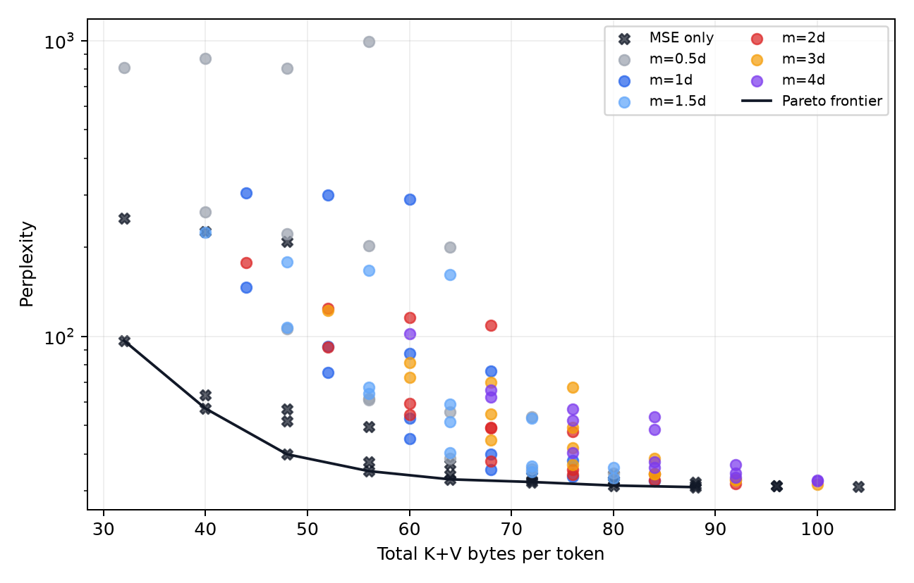
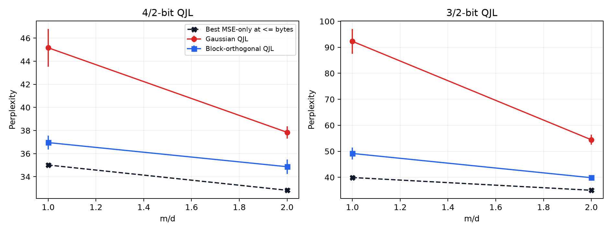

# TurboQuant QJL measurement-budget study

This repository is an independent, falsification-oriented study of whether QJL
sketch dimension `m` beyond head dimension `d` improves TurboQuant-style
KV-cache attention enough to justify a larger research program. `../TurboQuant`
is only an implementation reference; no code here imports it at runtime, and it
was not modified.

## Outcome: the proposed research direction failed

**Final decision: Verdict A — Stop.**

The preliminary observation was real but did not support the stronger research
hypothesis. Holding the scalar key/value quantization fixed, increasing `m`
reduced QJL estimator error, reduced attention error, and improved GPT-2
perplexity. However, increasing `m` also consumed more cache storage. Once that
storage was allocated fairly, larger QJL sketches were consistently inferior to
spending the same—or fewer—bytes on a better scalar key/value representation.

The project therefore failed as a positive paper about oversized QJL or an
optimal measurement dimension. This is a useful negative result, not an
implementation failure and not evidence that QJL is universally harmful.

The complete decision document is [PHASE2_VALIDATION.md](PHASE2_VALIDATION.md).

## Original hypothesis

The strongest candidate hypothesis was:

> The useful QJL measurement budget is not universally `m=d`; it depends on
> quantization severity, and allocating extra bits to QJL measurements can be a
> better use of a fixed KV-cache budget than allocating those bits to scalar
> key/value precision.

This contained two distinct claims:

1. **Conditional QJL claim:** if residual QJL is already part of the pipeline,
   increasing `m` improves downstream attention quality.
2. **Fixed-budget allocation claim:** at a fixed total KV-cache size, spending
   bytes on additional QJL measurements is competitive with spending them on
   scalar K/V precision.

The conditional claim survived. The fixed-budget claim—the claim required for
a useful design rule or paper—failed.

## What was tested

The study used GPT-2 with head dimension `d=64` and the WikiText-2 raw test
split. The main Phase 2 allocation experiments evaluated the first 512 tokens in
FP16 on Apple MPS. QJL comparisons used five isolated projection seeds:
`11, 23, 37, 53, 71`.

The framework tested:

- FP16/unquantized perplexity;
- Gaussian residual QJL matching the local TurboQuant-style implementation;
- `m/d` values from `0.5` through `4` in the broad sweep;
- a fine sweep at `m/d = {1, 1.25, 1.5, 1.75, 2, 2.5, 3, 4}`;
- moderate 4/2-bit and aggressive 3/2-bit key/value quantization;
- scalar key precisions from 2 through 8 bits and value precisions from 1
  through 5 bits in the allocation controls;
- `m=0` MSE-only controls that omit residual QJL entirely;
- exactly matched and near-matched packed KV-cache byte budgets;
- packed scalar indices, QJL signs, vector/residual norms, and value metadata;
- shared projection storage reported separately from per-token storage;
- QJL residual RMSE, attention-logit RMSE, attention KL, PPL, runtime, residual
  norms, and per-layer diagnostics;
- a 2048-token confirmation from the initial study;
- a post-gate block-orthogonal projection control based on the construction used
  in the original public QJL implementation;
- 553 allocation runs across 121 summarized configurations, 80 fine-sweep runs
  across 16 configurations, and 20 block-orthogonal control runs.

Raw results are append-only JSONL under `results/raw/`. Tables and plots are
generated programmatically; numerical result tables are not manually copied
into the reports.

## What happened

### 1. The original `m=2d` observation replicated

For Gaussian residual QJL, every one of the five paired seeds improved from
`m=d` to `m=2d`:

| Key/value bits | `m=d` PPL | `m=2d` PPL | Mean paired change |
|---:|---:|---:|---:|
| 4/2 | 45.16 +/- 1.63 | 37.84 +/- 0.53 | -7.32 PPL |
| 3/2 | 92.29 +/- 4.77 | 54.43 +/- 1.94 | -37.85 PPL |

The initial study's 2048-token 4/2-bit check showed the same direction:
42.70 PPL at `m=d` versus 30.57 at `m=2d`, against FP16 PPL 22.77.

Estimator and attention-logit RMSE followed the expected `m^-1/2` scaling. The
normalization was independently checked: QJL estimator MSE followed an
approximately `1/m` law with fitted log-log slope `-0.999`. The improvement was
therefore not caused by incorrectly dividing by `d` when `m != d`.

### 2. The conditional operating point changed with quantization severity

In the fine Gaussian sweep, the smallest tested measurement count closing 90%
of the observed `m=d -> 4d` PPL gain was:

- `m=2.5d` for 4/2-bit quantization;
- `m=3d` for the more aggressive 3/2-bit quantization.

The larger residual produced by aggressive quantization remained
measurement-limited longer. At `m=d`, the mean residual norm at 3/2 bits was
approximately 1.86 times the 4/2-bit value. This is a real conditional pattern,
but it is not a useful fixed-storage optimum.

### 3. Exact-budget comparisons rejected the allocation hypothesis

At 60 bytes/token:

- 4/2-bit with `m=d`: 45.16 PPL;
- 3/2-bit with `m=2d`: 54.43 PPL.

The oversized-QJL allocation was worse by 9.27 PPL, with a paired 95% confidence
interval of 5.11 to 13.43.

At 68 bytes/token:

- 5/2-bit with `m=d`: 35.43 PPL;
- 4/2-bit with `m=2d`: 37.84 PPL.

The oversized-QJL allocation was worse by 2.41 PPL, with a paired 95% confidence
interval of 0.93 to 3.90.

### 4. Removing residual QJL was often better and cheaper

At the same base scalar precision:

- 4/2-bit MSE-only: 39.91 PPL at 48 bytes/token;
- 4/2-bit Gaussian `m=d`: 45.16 PPL at 60 bytes/token;
- 3/2-bit MSE-only: 57.00 PPL at 40 bytes/token;
- 3/2-bit Gaussian `m=d`: 92.29 PPL at 52 bytes/token.

Increasing `m` eventually made correction better than omitting the residual at
the same base precision: the first tested Gaussian crossover was `1.75d` for
4/2 and `2d` for 3/2. But those corrected configurations still lost to a better
scalar allocation using the same or fewer total bytes.

After extending scalar-only controls through 8-bit keys and 5-bit values, every
measured point on the PPL/storage Pareto frontier through 88 bytes/token was
MSE-only (`m=0`). Oversized Gaussian QJL never entered that frontier.



### 5. Projection construction mattered, but did not rescue QJL allocation

The original QJL paper and public code use QR-orthogonalized projection blocks,
whereas the TurboQuant-style residual implementation under test uses Gaussian
rows. Block orthogonalization substantially improved absolute results:

| Configuration | Gaussian PPL | Block-orthogonal PPL |
|---|---:|---:|
| 3/2, `m=d` | 92.29 | 49.16 |
| 3/2, `m=2d` | 54.43 | 39.84 |
| 4/2, `m=d` | 45.16 | 36.95 |
| 4/2, `m=2d` | 37.84 | 34.87 |

This exposed a genuine implementation sensitivity. Nevertheless, every tested
block-orthogonal point remained worse than an MSE-only allocation using four
fewer bytes/token. For example, block-orthogonal 4/2 `m=2d` achieved 34.87 PPL
at 68 bytes, while MSE-only 5/3 achieved 32.83 at 64 bytes.



### 6. Aggregate estimator error was not enough to predict downstream harm

The most revealing counterexample occurred at 3/2 bits:

| Method | Logit RMSE | Attention KL | PPL |
|---|---:|---:|---:|
| MSE-only | 1.604 | 0.339 | 57.00 |
| Gaussian QJL, `m=d` | 1.416 | 0.539 | 92.29 |

QJL reduced aggregate logit RMSE but substantially worsened attention KL and
PPL. Removing average inner-product bias is therefore not sufficient. The
distribution, covariance, and tails of correction noise—and where that noise
lands in the softmax—matter more than a single global RMSE value.

Attention harm was also layer-concentrated: the three largest layers accounted
for about 62–66% of summed layer attention KL. This suggests that residual
energy and attention sensitivity may be more informative than a global `m/d`.

## Why the proposed direction failed

The project was stopped for four independent reasons:

1. **The fair-budget claim failed.** More scalar precision consistently beat
   oversized QJL at the tested exact budgets.
2. **The stronger no-correction control won.** Residual QJL could hurt while
   consuming additional bytes, and no QJL configuration entered the measured
   storage/PPL Pareto frontier.
3. **The positive framing was not novel.** The 2024 QJL paper defines arbitrary
   `m`; its public implementation already uses `m=2d` generally, `m=4d` in
   selected layers, and sweeps `m/d` for distortion.
4. **The remaining evidence was too narrow.** Phase 2 established the allocation
   result only on GPT-2 and one WikiText-2 prefix. A second-model download/setup
   was attempted, but no valid OPT-125M result completed before the stop gate.
   Cross-model and independent-slice generalization are therefore inconclusive,
   not negative.

The literature audit also found direct or adjacent novelty threats: a recent
fair-budget analysis proposes the same QJL-variance/softmax mechanism, current
deployment-oriented TurboQuant paths remove QJL, and layerwise/joint bit
allocation is already a crowded research area. See
[notes/literature_audit.md](notes/literature_audit.md).

## What survived

- Increasing `m` consistently reduces QJL estimator and attention-logit error.
- When QJL is held in the pipeline, larger `m` can dramatically improve PPL.
- The number of measurements needed to make correction non-harmful increases
  under more aggressive scalar quantization.
- Projection covariance matters: block-orthogonal QJL is much stronger than
  independent Gaussian QJL at the same `m`.
- Residual magnitude and layer sensitivity plausibly help explain correction
  utility.
- Aggregate logit RMSE can disagree with attention KL and downstream PPL.

These are replicated findings for this GPT-2 setup, not universal claims.

## Better research question exposed by the failure

The failure suggests that `m` is not the fundamental research variable. The
more useful question is:

> Under a fixed KV-cache budget, what measurable conditions make stochastic
> residual correction improve downstream attention more than either omitting
> the residual or spending those bits on a lower-variance scalar
> representation?

The experiments reveal three distinct regimes:

1. residual correction is harmful;
2. correction becomes helpful relative to leaving the scalar residual
   uncorrected;
3. correction becomes globally worthwhile relative to the best alternative use
   of the same bytes.

This study observed transitions from regime 1 to regime 2, but never reached
regime 3.

A plausible correction-utility criterion would need to compare the
attention-weighted error of omitting the residual against the variance and
storage cost introduced by correction. Candidate predictors include:

- residual norm and omitted-residual logit bias;
- query norm and correction-error variance/tails;
- projection covariance or orthogonality;
- attention entropy, concentration, or top-logit margin;
- layer/head sensitivity;
- scalar K/V precision and exact remaining byte budget.

This could eventually become a study of the bias–variance boundary for
residual correction in quantized softmax attention. The current repository does
not yet establish a predictive rule or justify an adaptive algorithm.

## Only experiment that could justify reopening the project

Do not begin a larger-model sweep. First run one cheap, preregistered gate on a
genuinely different small architecture and multiple independent text slices.
At each exact byte budget compare:

1. a higher-precision scalar-only allocation;
2. a lower-precision scalar-only allocation;
3. the same lower-precision base plus official-style block-orthogonal residual
   QJL.

Measure residual magnitude, correction variance/tails, attention entropy or
margin, per-layer/head KL, and loss change. Apply correction to individual
layers or heads as a controlled intervention to estimate marginal downstream
sensitivity; do not build an adaptive policy yet.

Stop again if residual correction does not enter the exact-budget Pareto
frontier, or if a small set of pre-correction statistics cannot predict whether
it helps. Only a cross-model, held-out predictive boundary would justify a new
research direction or larger-model spending.

## Repository map

- [PHASE2_VALIDATION.md](PHASE2_VALIDATION.md): final decision document.
- [INITIAL_STUDY.md](INITIAL_STUDY.md): preliminary replication that originally
  passed the first gate.
- [notes/research_log.md](notes/research_log.md): chronological hypotheses,
  results, confounders, and decisions.
- [notes/findings.md](notes/findings.md): findings that survived replication.
- [notes/literature_audit.md](notes/literature_audit.md): primary-source and
  public-code novelty audit.
- `configs/`: immutable experiment specifications.
- `results/raw/`: append-only machine-readable runs.
- `results/summary/`: generated CSV/JSON summaries.
- `results/plots/`: generated figures.
- `scripts/`: experiment, analysis, and report-generation entry points.

## Reproduction

Run a cheap mathematical sanity check:

```bash
python3 scripts/run_qjl_sanity.py --seeds 200 --trials 128
```

After installing the optional experiment dependencies, reproduce the empirical
study and generated report:

```bash
.venv/bin/python scripts/run_llm_sweep.py --models gpt2 --ratios 0.5 1 2 4 --qjl-seeds 11 23 37 53 71 --configs 4,2 3,2 --tokens 512 --stride 256
.venv/bin/python scripts/run_llm_sweep.py --models gpt2 --ratios 1 2 --qjl-seeds 11 23 37 53 71 --configs 4,2 --tokens 2048 --stride 512 --out results/raw/llm_length_check.jsonl
.venv/bin/python scripts/benchmark_cache_runtime.py
.venv/bin/python scripts/analyze.py
.venv/bin/python scripts/render_initial_study.py
```

Results are append-only JSONL under `results/raw/`; summaries and plots are
generated from those raw records. See `notes/research_log.md` before treating
any outcome as evidence.

The completed initial verdict and limitations are in `INITIAL_STUDY.md`.

## Phase 2 decision-grade validation

The Phase 2 configs are immutable experiment specifications. Reproduce the
allocation, fine-sweep, scalar-only, and projection-sensitivity runs with:

```bash
.venv/bin/python scripts/run_llm_sweep.py --models gpt2 --spec-file configs/phase2_equal_budget.json --qjl-seeds 11 23 37 53 71 --tokens 512 --stride 256 --study-id phase2-equal-budget-confirmatory --out results/raw/phase2_equal_budget.jsonl
.venv/bin/python scripts/run_llm_sweep.py --models gpt2 --spec-file configs/phase2_equal_budget_extension.json --qjl-seeds 11 23 37 53 71 --tokens 512 --stride 256 --study-id phase2-equal-budget-extension-confirmatory --out results/raw/phase2_equal_budget_extension.jsonl
.venv/bin/python scripts/run_llm_sweep.py --models gpt2 --spec-file configs/phase2_mse_only_extension.json --qjl-seeds 11 23 37 53 71 --tokens 512 --stride 256 --study-id phase2-mse-only-confirmatory --out results/raw/phase2_mse_only.jsonl
.venv/bin/python scripts/run_llm_sweep.py --models gpt2 --spec-file configs/phase2_high_scalar_controls.json --qjl-seeds 11 --tokens 512 --stride 256 --study-id phase2-high-scalar-confirmatory --out results/raw/phase2_high_scalar.jsonl
.venv/bin/python scripts/run_llm_sweep.py --models gpt2 --spec-file configs/phase2_fine_m.json --qjl-seeds 11 23 37 53 71 --tokens 512 --stride 256 --study-id phase2-fine-m-confirmatory --out results/raw/phase2_fine_m.jsonl
.venv/bin/python scripts/run_llm_sweep.py --models gpt2 --spec-file configs/phase2_block_orthogonal_control.json --qjl-seeds 11 23 37 53 71 --tokens 512 --stride 256 --projection-mode block_orthogonal --study-id phase2-block-orthogonal-confirmatory --out results/raw/phase2_block_orthogonal.jsonl
```

The runner refuses duplicate records in an existing output. To regenerate all
tables, plots, and the decision document solely from raw results:

```bash
.venv/bin/python scripts/analyze_phase2.py
.venv/bin/python scripts/render_phase2_validation.py
```

The result is [PHASE2_VALIDATION.md](PHASE2_VALIDATION.md), with the complete
primary-source audit in [notes/literature_audit.md](notes/literature_audit.md).
